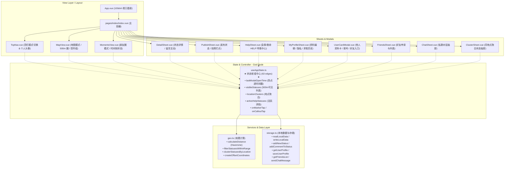
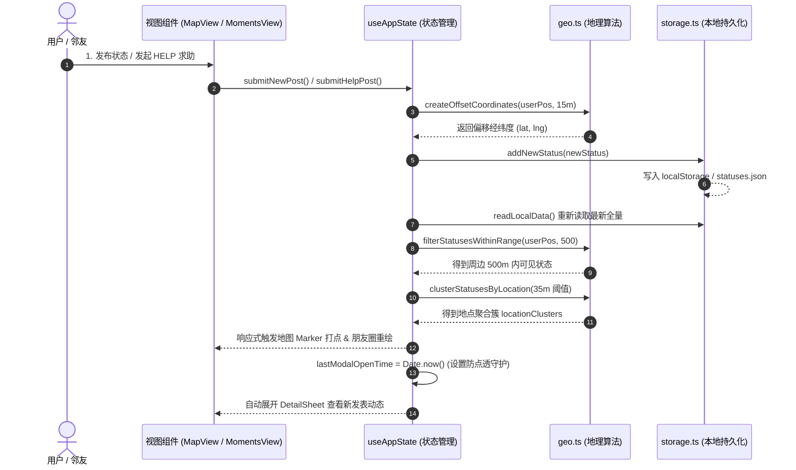

# 🗺️ 500米邻里社交圈 - 完整项目知识图谱与速查指引
> **生成时间**：2026-09-22  
> **核心枢纽节点**：301 个 Nodes · 501 条 Edges · 18 个功能社区 (Community)  
> **交互式可视化入口**：
> - 🌐 **力导向拓扑全景图**：[graphify-out/graph.html](file:///Users/trovant/map/graphify-out/graph.html)
> - 🌳 **D3 树状层级图谱**：[graphify-out/GRAPH_TREE.html](file:///Users/trovant/map/graphify-out/GRAPH_TREE.html)
> - 📊 **社区与中心度审计报告**：[graphify-out/GRAPH_REPORT.md](file:///Users/trovant/map/graphify-out/GRAPH_REPORT.md)

---

## 🎯 一、功能修改快速定位索引表 (修改需求直达指南)

当未来需要新增、修复或调整功能时，按以下映射直接跳转到对应文件与代码行：

| 需求场景 / 功能模块 | 核心处理文件 (点击直达) | 关键函数 / 响应式状态 | 调整关注点 |
| :--- | :--- | :--- | :--- |
| **500米范围与距离计算** | [`src/services/geo.ts`](file:///Users/trovant/map/src/services/geo.ts) | `calculateDistance`, `isWithin500Meters`, `filterStatusesWithinRange` | Haversine 地球球面坐标计算、按距离倒序过滤 |
| **同地点多动态聚合算法** | [`src/services/geo.ts`](file:///Users/trovant/map/src/services/geo.ts) | `clusterStatusesByLocation` | 35米内聚类阈值、首发人提取与聚合数量 |
| **坐标模拟与偏移打点** | [`src/services/geo.ts`](file:///Users/trovant/map/src/services/geo.ts) | `createOffsetCoordinates` | 发布状态时的经纬度随机方位角与半径位移 (15m) |
| **本地存储 / 持久化** | [`src/services/storage.ts`](file:///Users/trovant/map/src/services/storage.ts) | `readLocalData`, `writeLocalData`, `getUserProfile`, `saveUserProfile` | H5 localStorage / 小程序文件系统双模存储 |
| **好友关系与私聊存储** | [`src/services/storage.ts`](file:///Users/trovant/map/src/services/storage.ts) | `getFriendsList`, `sendFriendRequest`, `acceptFriendRequest`, `sendChatMessage` | 手机号双向互验加好友、聊天记录持久化与自动模拟回复 |
| **全局核心状态机 (God Node)** | [`src/composables/useAppState.ts`](file:///Users/trovant/map/src/composables/useAppState.ts) | `useAppState()` (63 条依赖连线) | 统领所有数据、抽屉显示隐藏、点击防穿透、地图打点 |
| **地图点/气泡点击与防穿透** | [`src/composables/useAppState.ts`](file:///Users/trovant/map/src/composables/useAppState.ts) | `onMarkerTap`, `onCalloutTap`, `lastModalOpenTime` | 拦截 450ms 移动端合成点击穿透闪退、优先匹配本人状态 |
| **地图渲染与中心定位** | [`src/components/MapView.vue`](file:///Users/trovant/map/src/components/MapView.vue) | `<map>`, `myActiveHelp`, `topEmergencyHelp`, `right-controls` | 500m半透明紫圈、救命红圈、浮动控制栏、求助广播横幅 |
| **朋友圈模式与时间倒序** | [`src/components/MomentsView.vue`](file:///Users/trovant/map/src/components/MomentsView.vue) | `sortedMomentsStatuses`, `toggleLikeStatus`, `openDetailSheet` | 倒序动态流、大图排版(单图/四宫格/九宫格)、点赞留言预览 |
| **动态详情、评论与配图** | [`src/components/DetailSheet.vue`](file:///Users/trovant/map/src/components/DetailSheet.vue) | `activeStatus`, `handleSendComment`, `chooseCommentImage` | 底部/居中弹窗卡片、多级留言列表、作者卡片查看入口 |
| **发布状态与拍照上传** | [`src/components/PublishSheet.vue`](file:///Users/trovant/map/src/components/PublishSheet.vue) | `newPostContent`, `pickedImages`, `submitNewPost` | 最多3张配图、相册拍照选取、自动挂载当前坐标打点 |
| **急事 / 救命 HELP 求助** | [`src/components/HelpSheet.vue`](file:///Users/trovant/map/src/components/HelpSheet.vue) | `isEmergencyHelp`, `submitHelpPost`, `handleCloseHelp` | 双档求助切换、紧急电话直拨、2小时自动隐去、发起人关闭 |
| **个人资料与隐私开关** | [`src/components/MyProfileSheet.vue`](file:///Users/trovant/map/src/components/MyProfileSheet.vue) | `editingProfile`, `onPhonePrivacyChange`, `myHelpHistory` | 昵称/年龄/性别/签名/手机号公开或隐藏保密、求助历史记录 |
| **他人资料卡与加好友** | [`src/components/UserCardModal.vue`](file:///Users/trovant/map/src/components/UserCardModal.vue) | `viewingProfile`, `handleAddFriend`, `startChatFromCard` | 点击任意头像查看个人卡、展示距离、电话直拨、发起私聊 |
| **好友列表与聊天抽屉** | [`src/components/FriendsSheet.vue`](file:///Users/trovant/map/src/components/FriendsSheet.vue)<br>[`src/components/ChatSheet.vue`](file:///Users/trovant/map/src/components/ChatSheet.vue) | `friendsList`, `currentChatFriend`, `sendCurrentChatMessage` | 申请通知红点、私聊气泡、即时消息滚动、模拟邻友回复 |
| **响应式视口与全端自适应** | [`src/styles/global.scss`](file:///Users/trovant/map/src/styles/global.scss) | `.modal-mask`, `.app-layout`, `@media (min-width: 768px)` | `100dvh` 防浏览器工具栏遮挡、PC居中卡片、手机底部抽屉 |

---

## 🏛️ 二、系统架构依赖拓扑图 (Architecture Topology)



---

## 🔄 三、核心数据流转图 (Data Flow)



---

## 🛠️ 四、本地图谱维护与查询命令 (CLI Cheatsheet)

项目中已完整配置 `graphify` 引擎，支持在终端通过以下命令随时进行增量更新或关系查询：

### 1. 代码修改后增量更新图谱
```bash
graphify extract . --code-only
graphify cluster-only .
```

### 2. 探查最核心枢纽函数 (God Nodes)
```bash
graphify god-nodes --top 10
```

### 3. 自然语言查询架构与调用路径
```bash
# 查询两个函数之间的调用关系
graphify path "onMarkerTap" "openDetailSheet"

# 查询特定函数的技术解释
graphify explain "useAppState"

# 查询广度上下文
graphify query "如何修改求助帖的自动消失时间？"
```

### 4. 生成与查看全景 HTML 图谱
- 双击或在浏览器中打开：[`graphify-out/graph.html`](file:///Users/trovant/map/graphify-out/graph.html)
  - 支持按节点度数大小缩放、鼠标拖拽物理力导向模拟、节点检索与连线高亮。
- 树形折叠结构：[`graphify-out/GRAPH_TREE.html`](file:///Users/trovant/map/graphify-out/GRAPH_TREE.html)
