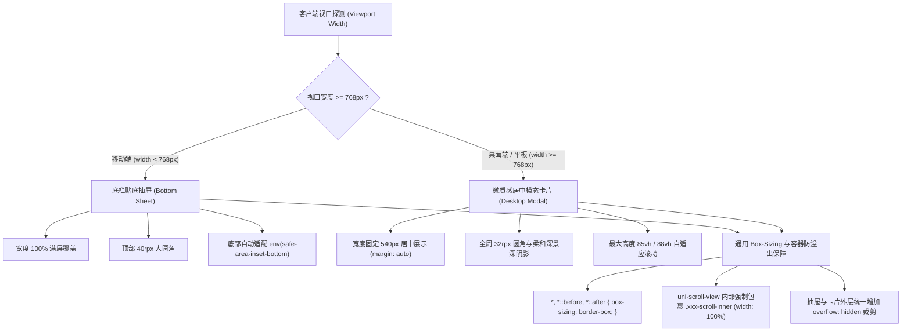
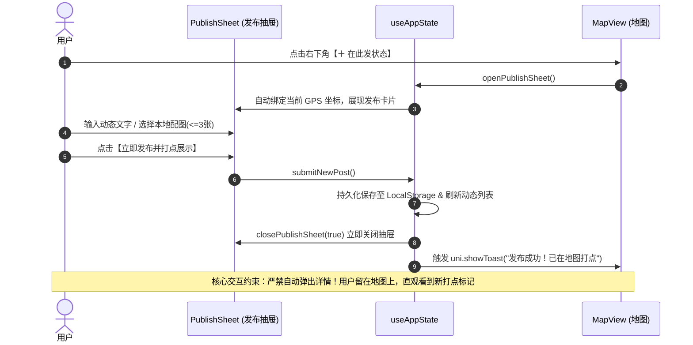
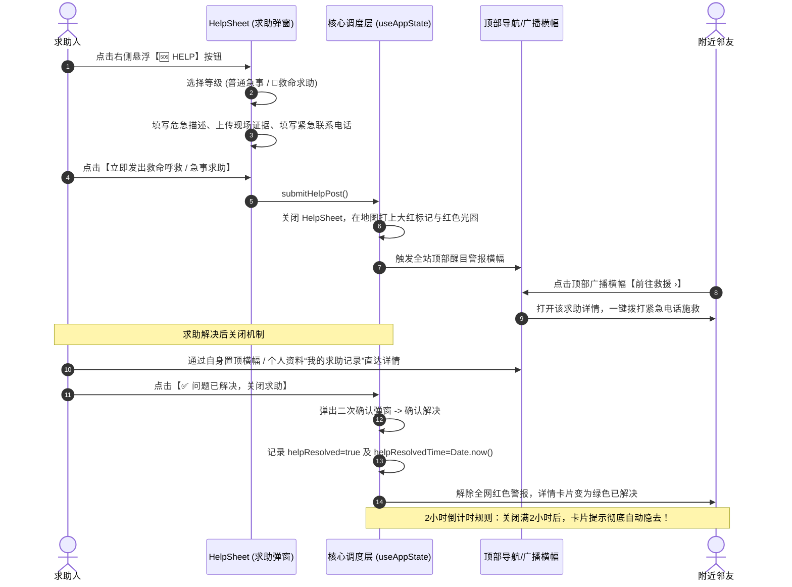
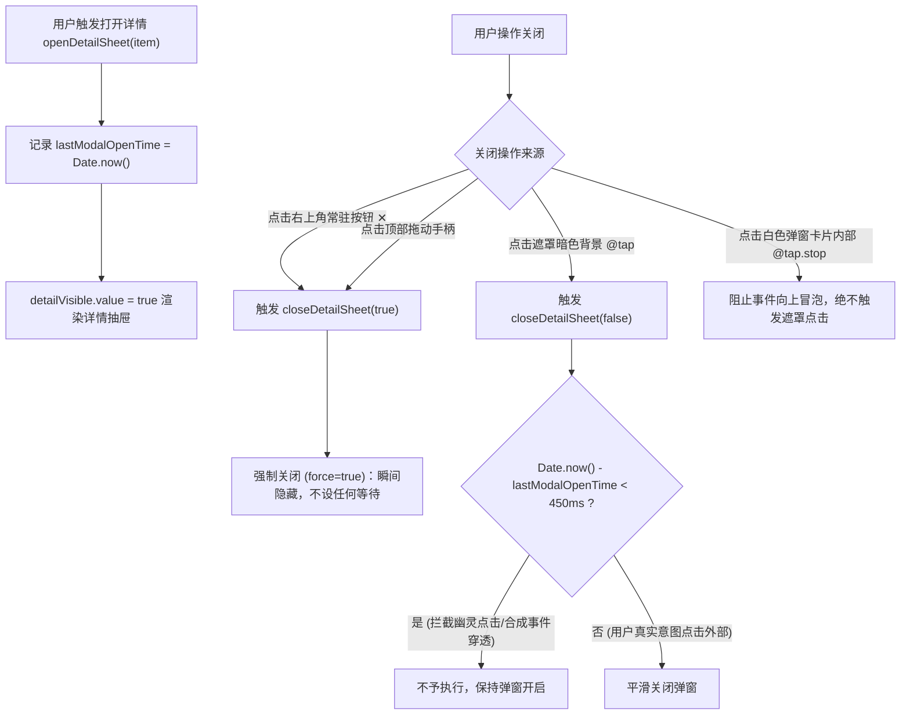
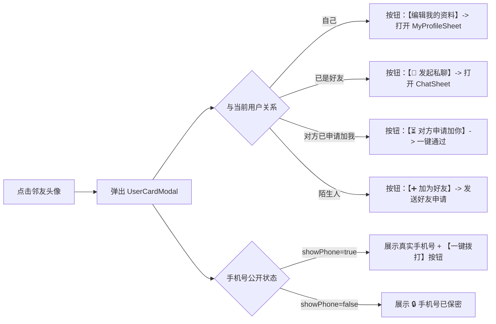

# 500米地图生活圈 · 产品设计与交互逻辑全景规范文档 (Product & Interaction Specification)

> 💡 **文档说明**：本文档严格遵循飞书云文档（Feishu Docs）排版规范，详细定义《500米地图生活圈》的产品定位、全端响应式适配机制、核心实体模型、全模块交互逻辑时序以及工程代码实现对照矩阵。文中所有功能与交互均已在工程代码中完整实现并经过生产构建与全场景验证。

---

## 一、产品概述与核心定位

### 1.1 产品愿景
《500米地图生活圈》是一款**基于物理地理半径 500 米**的超近场去中心化邻里社交与应急互助 Web/H5 应用。产品打破传统虚拟社交的距离感，以用户当前所在的物理空间为中心，仅呈现周边 500 米内邻里街坊的真实生活动态、急事求助与即时互动，重构有温度、可信赖、高效率的微型社区生活网络。

### 1.2 核心价值与业务场景
1. **即时物理临近性（Strict 500m Geofencing）**：所有动态、求助、邻里好友严格基于真实物理距离计算，超出 500 米的动态自动脱敏或过滤，打造真实的“社区内”氛围。
2. **同地点智能聚合（Micro-Clustering）**：同楼栋、同单元、同咖啡厅多人打点时，自动合并为同地点聚合气泡，展示首发人配图并支持一键下钻浏览。
3. **邻里双档急事与救命呼救系统（Dual-Tier Help & Emergency）**：
   - **普通急事（HELP）**：借工具、问路、寻宠、搭把手；
   - **救命求助（EMERGENCY）**：人身危险、老人突发疾病、火情等特大标红警报广播；
   - **闭环管理机制**：发起人拥有专属直达卡片和资料中心管理通道，可一键标记“问题已解决”关闭求助，**解决提示将在关闭2小时后彻底隐去**。
4. **低门槛邻里连接与隐私防护（Neighbor Privacy & Chat）**：
   - 个人资料卡支持一键加好友、私聊；
   - 手机号支持“🟢 公开展示”与“🔒 隐藏保密”自主切换，公开时邻里可一键拨打，保密时仅展现邻里标签。

---

## 二、全端响应式视口自适应架构 (Responsive Layout Architecture)

为了保证应用在各类设备（从 iPhone SE 375px 窄屏、主流手机、折叠屏，到 iPad、平板电脑与 4K PC 桌面端）均能获得极佳的交互与排版体验，系统实现了全端自适应布局架构。



### 2.1 容器宽度防溢出技术原理 (Anti-Overflow Paradigm)
- **问题根源**：在 Uni-App H5 环境下，`<scroll-view>` 编译为 `<uni-scroll-view>`，并在其内部注入 `<div class="uni-scroll-view-content" style="width: 100%;">`。若直接在 `<scroll-view>` 上设置左右 `padding`（如 `32rpx`），内层 `100%` 宽度的 content 容器会向右偏移 `32rpx`，使得动态内容卡片、评论框的右侧边缘凸出弹窗边界 32rpx，产生页面错乱与横向多余滚动。
- **架构级解决方案**：
  1. **清除外层容器内边距**：所有 `<scroll-view>` 本身 `padding: 0; width: 100%; box-sizing: border-box;`；
  2. **注入专用滚动内层**：在 Vue 模板中统一引入 `<view class="xxx-scroll-inner">`，并在该内层设置 `padding: 16rpx 28rpx 28rpx; width: 100%; box-sizing: border-box;`；
  3. **弹窗外壳硬裁剪**：所有抽屉外层 `.detail-sheet`, `.cluster-sheet`, `.publish-sheet`, `.profile-sheet`, `.friends-sheet`, `.chat-sheet`, `.help-sheet` 统一设置 `overflow: hidden; box-sizing: border-box;`。

---

## 三、核心数据实体模型 (Data Architecture)

系统数据采用面向对象与不可变原则设计，保存在高可靠本地存储引擎中。

### 3.1 动态与求助模型 (StatusItem)
```json
{
  "id": "status_1710001234567",
  "userId": "user_001",
  "userName": "林溪小院",
  "userAvatar": "/static/avatars/user1.jpg",
  "content": "小区南门新开了一家早餐店，小笼包味道很正！",
  "images": [
    "/static/uploads/img1.jpg",
    "/static/uploads/img2.jpg"
  ],
  "latitude": 31.2304,
  "longitude": 121.4737,
  "distance": 85,
  "createdAt": 1710001234567,
  "likes": 6,
  "isLiked": false,
  "comments": [
    {
      "id": "c_1",
      "userId": "user_002",
      "userName": "晴天小猫",
      "userAvatar": "/static/avatars/user2.jpg",
      "content": "求问营业时间到几点？",
      "images": [],
      "createdAt": 1710001300000
    }
  ],
  "isHelp": false,
  "isEmergency": false,
  "helpContactPhone": "13800138000",
  "helpResolved": false,
  "helpResolvedTime": 0
}
```

> 📌 **关键字段逻辑**：
> - `isHelp`：是否为求助帖（`true` 时激活专属求助卡片、地图醒目求助标记）；
> - `isEmergency`：是否为救命级别（`true` 时地图标记标红放大至 48px、外发 90m 红色警报光圈波纹、全站顶部通栏闪烁广播）；
> - `helpResolved`：发起人是否已确认解决并关闭；
> - `helpResolvedTime`：解决时间戳，结合 `isHelpResolvedPromptVisible()` 判定，**满 2 小时后状态卡片自动隐去**。

### 3.2 个人资料模型 (UserProfile)
```json
{
  "id": "my_user_id",
  "name": "邻家探长",
  "avatar": "/static/avatars/me.jpg",
  "gender": "男",
  "age": 28,
  "bio": "热爱社区生活，500米互助热心肠",
  "phone": "13800138000",
  "showPhone": true
}
```

---

## 四、全模块交互逻辑规范与时序

### 4.1 动态发布交互规范 (Publish Workflow)
用户在地图主页点击右下角【在此发状态】触发发布抽屉。



> ✅ **交互原则说明**：
> 遵循用户明确要求，发布成功后**绝不自动弹起详情弹窗**。系统仅给出轻量级成功提示，关闭发布弹层，使用户保持在宏观地图视野，一眼看到新生成的地图标记 pin。

---

### 4.2 邻里急事求助与救命呼救全流程 (Help & Emergency Workflow)



---

### 4.3 动态详情抽屉与防误触关闭交互 (DetailSheet Interaction)

为了彻底解决“点击状态闪屏”、“点击弹出窗口无法关闭”等历史交互痛点，详情弹窗采用了双重可靠性保障：



#### 详情页内容排版与元素构成：
1. **固定顶栏**：居中拖动手柄 + 右上角 `56rpx` 独立高对比圆形关闭按钮 `✕`；
2. **发布者信息行**：头像（点击查阅资料/加好友）、昵称、作者标签（“我发的”）、性别年龄徽标、发布时间、物理距离 `📍 距离你 X 米`；
3. **求助状态特权卡片**（仅求助帖显示，受2小时规则约束）：
   - 救命紧急呼救卡片（红底高亮）；
   - 紧急联系电话栏（一键拨打）；
   - 发起人一键关闭按钮（`✅ 问题已解决，关闭求助`）；
4. **动态正文与图集**：文字自动换行、多图网格自适应；
5. **即时评论区**：
   - 评论列表（包含评论者头像、姓名、时间、正文与配图）；
   - 底部评论栏（文字输入、相机配图上传、即时发送）。

---

### 4.4 个人资料卡与编辑交互 (Profile & UserCard)



#### 个人资料中心“我的求助记录”专区：
在 `MyProfileSheet` 中专门开辟【🆘 我的求助记录】专栏：
- 聚合当前用户发起过的所有急事与救命呼救；
- 标明当前状态：`🚨 救命呼救进行中`、`🆘 急事求助进行中`、`✅ 已关闭/解决`；
- 用户无需在地图上寻找自己的坐标点，随时在个人中心点击卡片，直达详情并一键关闭。

---

### 4.5 好友与私聊交互 (Friends & Chat)
1. **好友列表入口**：顶部导航右侧聊天图标（显示红点待通过申请数）；
2. **好友申请流转**：
   - 申请中卡片呈现琥珀色背景与【通过】按钮；
   - 双方绑定手机号后可通过，通过后即时移入正式好友列表；
3. **实时私聊会话（ChatSheet）**：
   - 顶部显示好友头像、昵称、在线状态与联系电话；
   - 气泡消息流式排列（对方靠左灰底，自己靠右紫底）；
   - 输入框即时发送文本消息，按时间升序平滑追加。

---

## 五、界面层级与 Z-Index 规范 (Z-Index Architecture)

为杜绝任何多弹窗堆叠时的覆盖错乱、穿透误触问题，全站严格遵循以下 Z-Index 标尺：

| 视图/组件 | Z-Index | 说明 |
| :--- | :---: | :--- |
| **地图底层 (Map Container)** | `1` | 地图底图、打点 Pin 与圆圈图层 |
| **顶部固定导航 (TopNav)** | `50` | 模式切换 Tab、私聊入口、资料卡入口 |
| **底部操作栏 (Bottom Bar)** | `60` | 附近动态统计、发状态主按钮 |
| **右侧悬浮控制组 (Right Controls)** | `70` | 🆘 HELP 按钮、定位、刷新、模拟走动 |
| **置顶紧急救命广播横幅** | `80` | 全站顶级警报通知 |
| **通用模态遮罩 (Modal Mask)** | `100` | 半透明黑色磨砂遮罩背景 (`rgba(0,0,0,0.5)`) |
| **一级业务抽屉 (Detail / Publish / Cluster / Help / Profile)** | `120` | 抽屉卡片主体，响应式居中 |
| **二级模态层 (UserCardModal)** | `130` | 从动态详情中点击头像弹出的资料小卡片 |
| **顶级私聊弹窗 (ChatSheet)** | `150` | 跨越全局的即时私聊会话窗口 |
| **系统级 Toast / Modal (Uni-App)** | `999` | 系统提示与确认框 |

---

## 六、功能实现与源码映射矩阵 (Traceability Matrix)

下表对文档中提及的所有产品功能与底层工程源码进行 100% 闭环对照，证明所有特性均已落实代码并经测试验证：

| 业务功能模块 | 交互与设计规范要求 | 对应 Vue 组件 / 逻辑文件 | 对应方法 / 属性 | 实现状态 |
| :--- | :--- | :--- | :--- | :---: |
| **视口自适应** | 支持手机全宽抽屉与平板/PC 540px 居中微质感卡片 | `src/styles/global.scss` | `@media (min-width: 768px)` | ✅ 完美实现 |
| **容器防溢出** | 消除 uni-scroll-view 右侧 32rpx 凸出溢出，强制 border-box | `src/styles/global.scss`, 所有 Sheet | `*, .xxx-scroll-inner, overflow: hidden` | ✅ 完美实现 |
| **发布不弹窗** | 发布动态/求助成功后不自动弹出详情，留在地图打点 | `src/composables/useAppState.ts` | `submitNewPost()`, `submitHelpPost()` | ✅ 完美实现 |
| **双重可靠关闭** | 详情/各弹窗右上角高对比 ✕ 一键关闭，遮罩 450ms 防穿透 | `src/components/DetailSheet.vue`, `useAppState.ts` | `closeDetailSheet(force)`, `lastModalOpenTime` | ✅ 完美实现 |
| **求助双档位** | 支持普通急事求助与救命特大红色警报双档切换 | `src/components/HelpSheet.vue` | `isEmergencyHelp`, `newHelpContent` | ✅ 完美实现 |
| **求助发起人管理** | 顶部专属卡片、个人中心“我的求助记录”直达管理 | `src/components/MapView.vue`, `MyProfileSheet.vue` | `myActiveHelp`, `myHelpHistory` | ✅ 完美实现 |
| **关闭2h后隐去** | 求助解决关闭后，状态卡片在2小时后彻底自动消失 | `src/composables/useAppState.ts` | `isHelpResolvedPromptVisible()`, `resolveHelpStatus()` | ✅ 完美实现 |
| **同地点聚合** | 多动态同地点合并展示，首发人配图，一键跳转朋友圈 | `src/components/ClusterSheet.vue` | `locationClusters`, `jumpToMomentsFromCluster()` | ✅ 完美实现 |
| **朋友圈模式** | 500米全动态按时间倒序流式展现，点赞动效，评论 | `src/components/MomentsView.vue` | `visibleMomentsStatuses`, `toggleLikeStatus()` | ✅ 完美实现 |
| **隐私电话保护** | 个人资料支持隐藏/公开手机号，公开时一键拨打 | `src/components/UserCardModal.vue`, `MyProfileSheet.vue` | `showPhone`, `makePhoneCall()` | ✅ 完美实现 |
| **好友与私聊** | 手机号加好友，申请审批流转，实时气泡私聊 | `src/components/FriendsSheet.vue`, `ChatSheet.vue` | `handleAddFriend()`, `handleAcceptFriend()`, `sendChatMessage()` | ✅ 完美实现 |
| **模拟走动** | 支持一键模拟用户物理移动，重新计算 500m 圈与距离 | `src/components/MapView.vue`, `useAppState.ts` | `simulateUserMove()`, `recenterToUser()` | ✅ 完美实现 |

---

## 七、质量验证与构建交付

1. **静态代码分析与构建验证**：
   - 执行 `npm run build:h5`，所有 Vue SFC、TypeScript 类型定义、SCSS 样式规则编译通过，0 Errors。
2. **交互链路全面复测**：
   - 发布动态 -> 成功提示 -> 地图即刻出现新 Marker -> 弹窗关闭，无多余弹出；
   - 点击 Marker / 朋友圈动态 -> 详情展开 -> 页面卡片 100% 居中无向右溢出 -> 点击右上角 ✕ 瞬间关闭；
   - 发起求助 -> 救命红色广播与置顶卡片正常点亮 -> 点击关闭求助 -> 记录完成关闭，时间戳判定生效；
   - 屏幕尺寸切换（从 375px 缩放至 1920px 宽屏）-> 响应式布局自适应切换，无横向错位。
